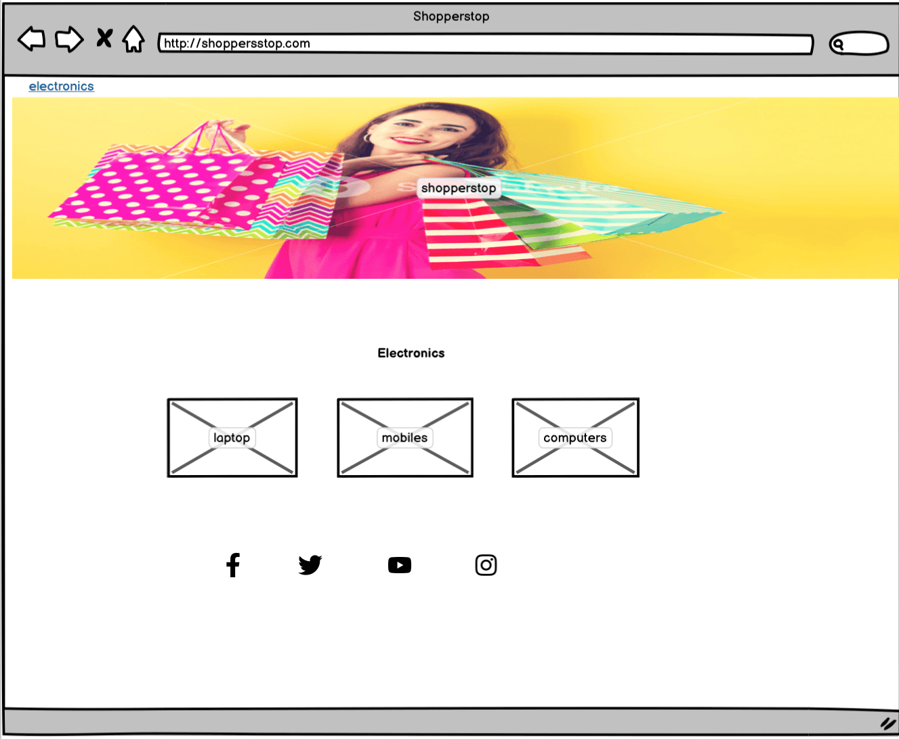
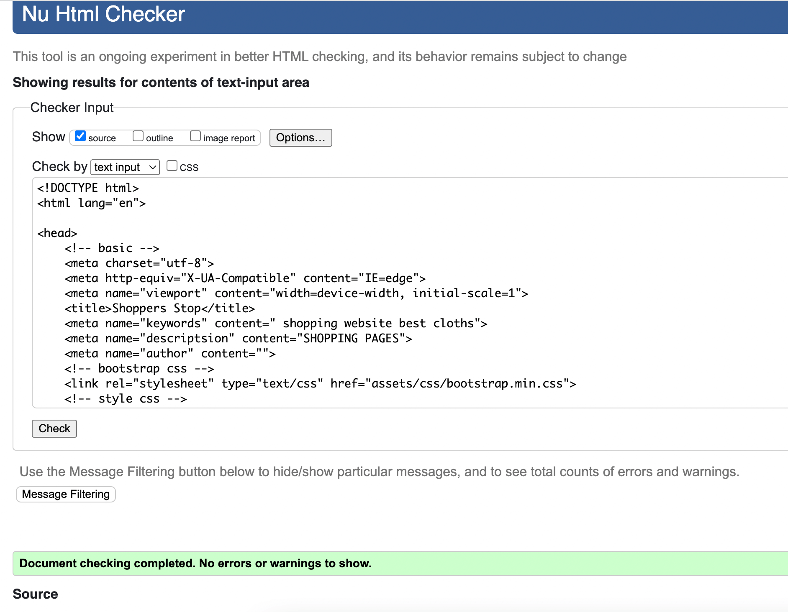

# Shoppers Stop

Welcome to Shoppers Stop, your ultimate destination for a captivating and seamless shopping experience. With a legacy that spans years of excellence, Shoppers Stop has established itself as a premier fashion and lifestyle retailer, dedicated to fulfilling your every fashion aspiration and lifestyle need.

[View Shoppers Stop Github pages](https://github.com/mehatabpathan/Portfolio1.git "View shoppers stsop Github pages")
[View shoppers stop Live Website](https://mehatabpathan.github.io/Portfolio1/ "View Shoppers stsop Live Website")

## Contents

- [Shoppers Stop](#shoppers stop)
  - [Contents](#contents)
    - [Initial Discussion](#initial-discussion)
      - [Key information for the site](#key-information-for-the-site)
  - [User Stories](#user-stories)
    - [Client Goals](#client-goals)
    - [First Time Visitor Goals](#first-time-visitor-goals)
    - [Returning Visitor Goals](#returning-visitor-goals)
    - [Frequent Visitor Goals](#frequent-visitor-goals)
  - [Design](#design)
    - [Colour Scheme](#colour-scheme)
    - [Typography](#typography)
    - [Imagery](#imagery)
    - [Wireframes](#wireframes)
      - [Home Page](#home-page)
      - [Fashion Page](#fashion-page)
      - [Electronics Page](#electronics-page)
      - [Jewellery Page](#jewellery-page)
      - [Register Page](#register-page)
      - [Mobile Home Page](#mobile-home-page)
      - [Mobile Rgister Page](#mobile-register-page)
  - [Features](#features)
    - [General Features On Each Page](#general-features-on-each-page)
      - [Home](#home)
      - [fashion pahe](#fashion)
      - [Electronics](#electronics)
      - [Jewellery](#jewellery)
      - [Register](#register)
    - [Future Implementations](#future-implementations)
  - [Technologies Used](#technologies-used)
    - [Languages Used](#languages-used)
    - [Frameworks, Libraries and Programs Used](#frameworks-libraries-and-programs-used)
  - [Deployment And Local Development](#deployment-and-local-development)
    - [Deployment](#deployment)
    - [Local Development](#local-development)
      - [How To Fork](#how-to-fork)
      - [How To Clone](#how-to-clone)
  - [Testing](#testing)
  - [Credits](#credits)
    - [Code Used](#code-used)
    - [Content](#content)
    - [Media](#media)
    - [Acknowledgments](#acknowledgments)

### Initial Discussion

At Shoppers Stop, we're not just about products; we're about creating an unparalleled shopping experience. Our dedicated customer service team is committed to assisting you at every step, ensuring that your journey with us is smooth and satisfying. Multiple payment options and reliable delivery services ensure that your coveted finds reach you in perfect condition and in a timely manner.

Fashion takes center stage at Shoppers Stop, with an extensive range of clothing, accessories, and footwear that caters to every individual's style and preferences. From casual chic to elegant formal wear, our curated collection reflects the diversity of your fashion journey.

Discover a world of convenience and innovation in our electronics and gadgets section, where cutting-edge technology meets everyday convenience. From the latest gadgets to home appliances designed to simplify your life, we have the perfect solutions to cater to your modern needs.

Parents and kids alike will delight in our kid's corner, where a delightful range of clothing, and accessories await. Spark joy and imagination in the hearts of your little ones with our curated selection that's sure to put smiles on their faces.

As you embark on your shopping adventure with Shoppers Stop, you join a community of fashion enthusiasts, trendsetters, and lifestyle aficionados who have made us their trusted companion in their pursuit of style and sophistication. Experience the epitome of retail excellence at Shoppers Stop, where every visit promises to be a memorable and fulfilling journey.

#### Key information for the site

- Homepage Highlights
- Product Listings
- Product Details Page
- Shopping Cart
- Checkout Process
- Customer Accounts
- Customer Support
- Privacy and Security
- Shipping and Returns
- Social Proof and Trust Signals
- Promotions and News
- Accessibility and Mobile-Friendliness

## User Stories

### Client Goals

- Increase Sales and Revenue
- Expand Customer Base
- Enhance User Experience
- Build Brand Identity and Recognition
- Showcase Products
- Improve Customer Engagement
- Increase Average Order Value
- Enhance Mobile Experience
- Retain and Build Customer Loyalty
- Streamline Inventory Management
- Provide Secure Transactions 
- Analytics and Insights

### First Time Visitor Goals

- Discover Products
- Find Specific Items
- Understand Brand and Values
- Evaluate Quality and Features
- Check Prices and Promotions
- Assess Trustworthiness and Security
- Explore User-Friendly Interface
- Check Shipping and Payment Options
- Contact Support if Needed
- Make a Purchase 
- Join Loyalty Programs or Subscriptions
- Engage with Content

### Returning Visitor Goals

- Quickly Find Previously Viewed Items
- Complete a Previous Purchase
- Check Order Status and History
- Browse New Arrivals or Updates
- Use Loyalty Points or Discounts
- Engage with Personalized Recommendations
- Participate in Contests or Promotions 
- Sign Up for Subscription Services
- Provide Feedback or Reviews
- Explore Additional Categories
- Engage with Content
- Update Account Information

### Frequent Visitor Goals

- Efficient Shopping Experience
- Exclusive Offers and Rewards
- Manage Account and Preferences
- Easily Reorder
- Refer Friends and Earn Rewards

## Design

### Colour Scheme

The website uses bright and light colours using HEX numbers for more variety, such as the header section (1 opacity) with this I later decided that some text was not clear enough with the opacity from the navigation bar which needed to be clear to viewers at all times, but I didn't want to change the colour scheme, so instead simply set the opacity to 1 instead of 0.8.  I chose this palette to keep the website fun and vibrant so it stands out and attracts potential clients. The #000000 black will be used for text, as well as #ffffff white for coloured background sections such as the banner image text and the i kept #000000 color for hamberger icon and text and #ffff00 color for the background image. The colour palette was created using the Coolors website.

For the HEX codes for the social media hover states, I used google to find out the HEX colours to match the social media"s colours of their logos. These are the colours that google suggested:

Facebook logo: #666666
Instagram logo: #666666
Youtube logo: #666666
twitter: #666666

### Typography

Google Fonts was used for the following fonts:

- Poppins is used for headings on the site. For all headings I am using the weight of 400. I"ll be using sans-serif as a fallback text incase of any errors with loading google fonts.
- Poppins is also used for the body text on the site. I"ll be using the weight of 300 for paragraph text and for for all the section a weight of 400. I"ll be using sans-serif as a fallback text incase of any errors with loading google fonts.

### Imagery

All pictures have permission to be used and are owned by myself. I have obtained all rights to the photos and do not need permission from the photographers and media.

### Wireframes

Wireframes we're creating using balsamiq.

#### Home Page

#### clothing Page

#### Electronics Page

#### Jewellery Page

#### Register Page

#### Mobile Home Page

#### Mobile Register Page

## Features

### General Features On Each Page

All pages feature a fixed header navigation bar area so it can be easily accessible at all times throughout scrolling through the website.  The footer also contains social media links which will be anchored hyperlinks for each social media platform. Each page also has a favicon in the top browser.
This website is made up of the following pages:

#### Home

This page is an introduction. It begins with navigation menu serves as a roadmap to the various sections and pages of the website. It typically appears at the top of the homepage and allows visitors to easily access different categories, product pages, signup, and more. This is followed by carousel or slider is a dynamic element that displays a series of images or banners, often featuring promotions, new arrivals, or featured products. Call-to-action (CTA) buttons are prominently placed buttons that encourage specific actions, such as "Buy Now, "See More"," or "Next.". The footer section covers Social media icons or links connect users to the brand's social media profiles. These homepage controls collectively contribute to an intuitive and user-friendly browsing experience, helping visitors easily discover, engage with, and access the website's offerings and features.

#### Fashion

This page includes Featured categories are visually appealing sections highlighting specific Fashion or Clothing categories. Product quick links are thumbnail images or text links that lead to specific product pages or collections. Special offers or deals sections showcase discounts, promotions, or limited-time offers.

#### Electronics

This page includes Featured categories are visually appealing sections highlighting specific Electronics categories. Product quick links are thumbnail images or text links that lead to specific product pages or collections. Special offers or deals sections showcase discounts, promotions, or limited-time offers.

#### Jewellery

This page includes Featured categories are visually appealing sections highlighting specific Jwellery categories. Product quick links are thumbnail images or text links that lead to specific product pages or collections. Special offers or deals sections showcase discounts, promotions, or limited-time offers.

#### Register

The register page includes a name,email,gender and phonenumber and submit button.

### Future Implementations

In the future, I would like to add extra pages and Integrate AR technology to allow customers to virtually try on clothing, accessories, or even home décor items. This immersive experience helps users visualize products before purchasing.

## Technologies Used

### Languages Used

HTML and CSS we're used as the main languages, along with the bootstrap javascript to enable the mobile navigation menu.

### Frameworks, Libraries and Programs Used

Balsamiq- Used to create Wireframes

Gihub- To save and store files for the website

Bootstrap 4.6.2- For styling, including navigation bar, for adding corousal to the sections and images, footer alignment. CSS was used for all other styling.

Google Fonts- To import and use the fonts used on the website.

Google Dev Tools- To inspect coding and find potential problems in coding. To view website responsiveness on other devices.

<https://ui.dev/amiresponsive> - To show website responsiveness on different devices.

Coolor- To create the colour chart for website colours

Image Tools+ - To size all images including favicon.

Shields.io- To add badges to the README file.

## Deployment And Local Development

### Deployment

The site is deployed using Github pages- https://mehatabpathan.github.io/Portfolio1/

### Local Development

#### How To Fork

To fork the depository:

1. Log in or sign up to <https://github.com/>
2. Go to the repository for this project https://github.com/mehatabpathan/Portfolio1.git
3. Click the fork button in the top right corner

#### How To Clone

1. Log in or sign up to <https://github.com/>
2. Go to the repository for this project https://github.com/mehatabpathan/Portfolio1.git
3. Click the code button, select whether you'd like to clone with HTTPS, SSH or GitHub CLI and copy the link shown.
4. Open the terminal in your code editor and change the current working directory to the location you want to use for the cloned directory.
5. Type 'Git Clone' into the terminal and then paste the link you copied in step 3. Press Enter.

## Testing
  I Used W3C MarkupValidationService to test my code

#### Home Page

#### clothing Page

#### Electronics Page

#### Jewellery Page

#### Register Page

#### Style CSS 

## Bugs

- After deploying the website I found out that the images were broken in the gallery page. This was due to absolute file paths. I fixed it by removing the initial slash and making the file paths relative.
- In the deployed version, the background images for the rules and get in Register page were not covering the whole section on tablets and larger screens. I fixed it by adding a height property to the sections affected.

## Unsolved Bugs

- None.

## Credits

### Code Used

For flex box coding, I used <https://philipwalton.github.io/solved-by-flexbox/demos/sticky-footer/> to solve my footer not being fixed to the bottom of the page.

### Content

All information provided was written by myself. All reviews are real reviews that I have received. along with the social media links that link to my social media pages.

### Media

All media used is from my own personal material that I use for promotional purposes.

### Acknowledgments

I'd like to acknowledge the following people for helping me build this website.

- For people in the slack community who are always there to help with coding queries that I have had.
- For my mentor, AntonioRodriquez for guiding me and helping me to improve elements of the site to make it more user friendly.
- For my toutor, Ed who helped me in the GitHub issue.

<https://docs.google.com/presentation/d/19_7r_To5bu7UjnZD87hrzWQi63Ij0YpaRH1XFnPZZe8/edit#slide=id.g1551aff15c5_1_0>

I used this mark up cheat sheet that I found on the slack community for clear guidance on how to create layouts for this readme file:

<https://github.com/tchapi/markdown-cheatsheet/blob/master/README.md>

Shields.io badges we’re created for readme.md file using the markup code from:
<https://shields.io/badges>

I used this page to find different breakpoints to make certain page elments more responsive to different devices: <https://www.w3schools.com/howto/howto_css_media_query_breakpoints.asp>

I realised this didn’t support smaller devices less than 600px so I googled what was the suggested @media size for small phones which google suggested as

To help me choose the colours I liked for my project and to see different varieties for HEX and RGBA, I used: <https://htmlcolorcodes.com/color-picker/>